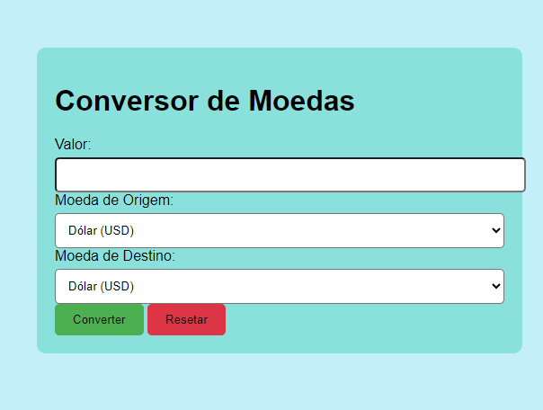

# conversor-moedas-API

## Conclusão
Este projeto é uma implementação simples de um conversor de moedas utilizando HTML, CSS e JavaScript, integrando-se a uma API de câmbio para realizar conversões dinâmicas. Ele pode ser estendido e melhorado de várias maneiras, incluindo a adição de mais moedas ou recursos como conversões múltiplas.

## Estrutura do Projeto
HTML (estrutura da página)
A página HTML define a estrutura do conversor, incluindo o formulário de entrada e a exibição do resultado da conversão.

 ## Corpo (Body):
Contém a estrutura principal da página: um formulário com campos para inserir o valor, selecionar a moeda de origem e a moeda de destino, além de um botão para realizar a conversão.
* Exibe o resultado da conversão.

## CSS (Estilo da Página)
O arquivo style.css pode ser usado para aplicar estilos ao layout da página, garantindo que a interface seja amigável e responsiva, ajustando-se a diferentes tamanhos de tela.

## JavaScript (Lógica da Conversão)
O arquivo script.js contém a lógica para capturar as entradas do usuário, consultar a API para obter as taxas de câmbio e exibir o resultado da conversão.

## Função Principal de Conversão:
API utilizada: O código utiliza a API ExchangeRate-API para obter as taxas de câmbio mais recentes.
Função getExchangeRate: Responsável por buscar a taxa de câmbio da moeda de origem para a moeda de destino.

 ## Função de Submissão do Formulário:
 * Ao submeter o formulário, a função captura o valor inserido, as moedas selecionadas e chama a função getExchangeRate para calcular a conversão.

 * Se a conversão for bem-sucedida, o valor convertido é exibido ao usuário. Caso contrário, uma mensagem de erro é exibida.

 ## Funcionamento Completo
 * O usuário insere o valor que deseja converter no campo "Valor".
 * Seleciona a moeda de origem e a moeda de destino.
 * Clica no botão "Converter".
 * O script JavaScript faz uma requisição à API para obter a taxa de câmbio e realiza a conversão, exibindo o resultado na tela.
 * O botão "Resetar" pode ser usado para limpar todos os campos do formulário.

 ## Como Rodar o Projeto
Clonar o Repositório:
* Clone o repositório para o seu computador.
Instalar Dependências:

* O projeto não possui dependências externas além da API utilizada, que é chamada diretamente no código. No entanto, para testar localmente, você pode usar um servidor HTTP simples ou abrir o arquivo HTML diretamente no navegador.

* Abrir no Navegador:

* Abra o arquivo index.html no seu navegador para visualizar e testar o conversor de moedas.

# RESULTADO 
O projeto final pode ser visto conforme imagem abaixo:

